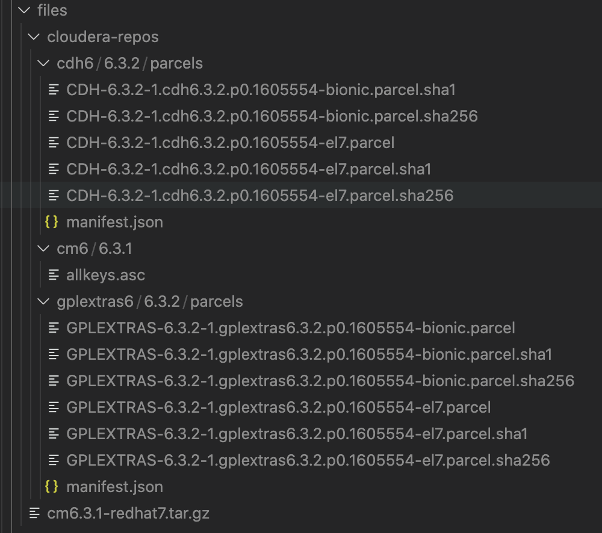

### 搭建 CDH 环境

使用vagrant结合ansible来搭建

#### 软件

1. 安装 vagrant
2. 安装 virtual box

#### 资源

1. 导入 vagrant box
   1. 下载：https://app.vagrantup.com/hashicorp-vagrant/boxes/centos-7.4
   2. 导入：

   			vagrant box add hashicorp-vagrant/centos-7.4 "下载后的文件名"
2. 下载 cdh 相关资源
   1. 下载:
   		
   			# 下载cdh6/6.3.2/parcels,用于安装软件
   			curl -O https://archive.cloudera.com/cdh6/6.3.2/parcels/CDH-6.3.2-1.cdh6.3.2.p0.1605554-el7.parcel
			curl -O https://archive.cloudera.com/cdh6/6.3.2/parcels/CDH-6.3.2-1.cdh6.3.2.p0.1605554-el7.parcel.sha1
			curl -O https://archive.cloudera.com/cdh6/6.3.2/parcels/CDH-6.3.2-1.cdh6.3.2.p0.1605554-el7.parcel.sha256
			curl -O https://archive.cloudera.com/cdh6/6.3.2/parcels/manifest.json
			
			# 下载 gplextras6/6.3.2/parcels/
			curl -O https://archive.cloudera.com/gplextras6/6.3.2/parcels/GPLEXTRAS-6.3.2-1.gplextras6.3.2.p0.1605554-el7.parcel
			curl -O https://archive.cloudera.com/gplextras6/6.3.2/parcels/GPLEXTRAS-6.3.2-1.gplextras6.3.2.p0.1605554-el7.parcel.sha1
			curl -O https://archive.cloudera.com/gplextras6/6.3.2/parcels/GPLEXTRAS-6.3.2-1.gplextras6.3.2.p0.1605554-el7.parcel.sha256
			curl -O https://archive.cloudera.com/gplextras6/6.3.2/parcels/manifest.json
			
			# 下载cm yum库
			curl -O https://archive.cloudera.com/cm6/6.3.1/repo-as-tarball/cm6.3.1-redhat7.tar.gz

   2. 导入：文件层次结构
   		1. 将下载后的文件放入到项目的`provision/roles/httpd/files`文件夹中，其结构如下

   			

#### 启动安装

1.  安装

        vagrant up

2.  重新安装

        vagrant destory -f
        vagrant up
        # 执行ansible
        vagrant reload controller --provision-with ansible_local

3.  暂停 controller 节点

    	vagrant halt controller

### 使用

1. 登录
   1. 地址: http://192.168.33.20:7180/
   2. 账号: admin/admin
2. 安装集群
   1. 添加主机，这里设置为

   			192.168.33.2[0-2]
   2. 设置 Parcels 地址，使用本地仓库(CDH and other software)
   		1. 点击更多选项
   		2. 删除使用 Cloudera 的地址 
   		3. 添加本地仓库地址

   				http://master-1/cloudera-repos/cdh6/6.3.2/parcels/
   3. 设置 Activity Monitor 的数据库信息：amon
   4. 等待集群安装完成
3. 修改本地hosts文件

		192.168.33.21  node-1
		192.168.33.22  node-2
		192.168.33.20  master-1 
